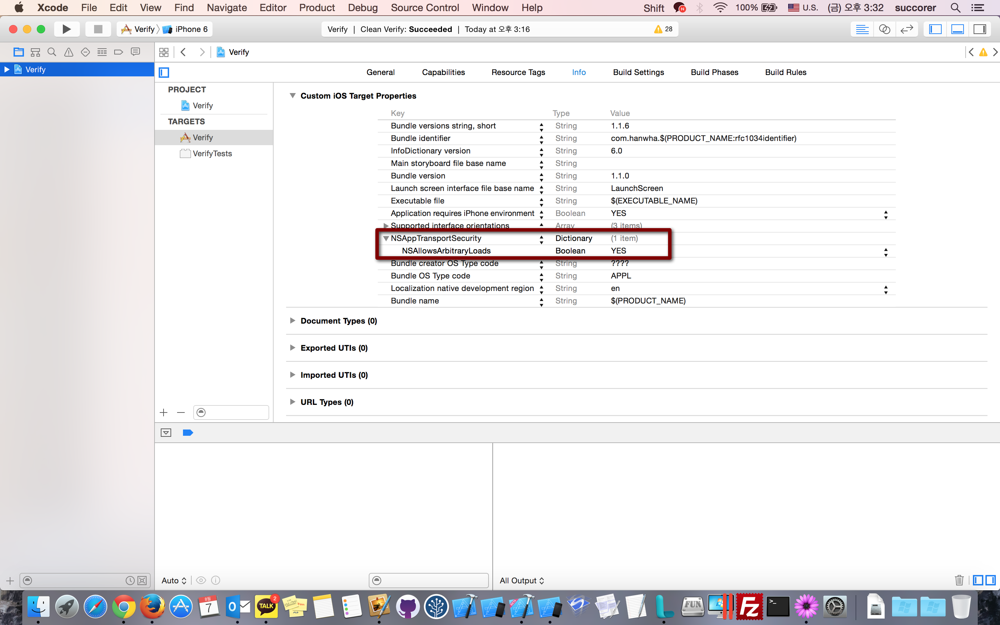

#ATS

*	

````
iOS9 대응하려고 빌드에러 잡고 실행을 해 보았는데 잘되던 인증과정이 에러가 난다..
Error Domain=NSURLErrorDomain Code=-1022 "The resource could not be loaded because the App Transport Security policy requires the use of a secure connection." UserInfo=0x7fb7abdb6d50 {NSUnderlyingError=0x7fb7ac22f2b0 "The resource could not be loaded because the App Transport Security policy requires the use of a secure connection.", NSErrorFailingURLStringKey=http://xxxxxx, NSErrorFailingURLKey=http://xxxxxx, NSLocalizedDescription=The resource could not be loaded because the App Transport Security policy requires the use of a secure connection.}

당황해 하고 있다가 겨우 찾아냄

Project Info

info tab

add NSAppTransportSecurity(Type Dictionary)

add NSAllowsArbitraryLoads(Type boolean) YES

````
# 약전계 테스트

http://nshipster.com/network-link-conditioner/

https://developer.apple.com/downloads/

# Storyboard TableViewController 뷰가 아래로 내려가는 문제

코드로 

navigationBar.translucent = NO;

스토리보드 NavigationBar 속성에

Translucent 체크 해제

# PFXStudio

Mobile : http://pfxstudio.modoo.at/

Twitter : http://twitter.com/pfxstudio

Facebook : http://facebook.com/pfxstudio

Github : https://github.com/PFXStudio

iOS AppStore : https://itunes.apple.com/us/artist/ppark/id448017898

Google Play : https://play.google.com/store/apps/developer?id=PFXStudio
