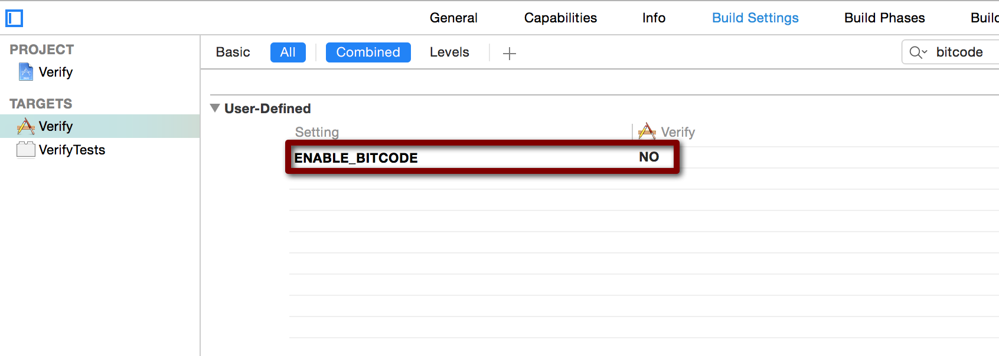

#iOS9 ATS

*	

````
iOS9 대응하려고 빌드에러 잡고 실행을 해 보았는데 잘되던 인증과정이 에러가 난다..
Error Domain=NSURLErrorDomain Code=-1022 "The resource could not be loaded because the App Transport Security policy requires the use of a secure connection." UserInfo=0x7fb7abdb6d50 {NSUnderlyingError=0x7fb7ac22f2b0 "The resource could not be loaded because the App Transport Security policy requires the use of a secure connection.", NSErrorFailingURLStringKey=http://xxxxxx, NSErrorFailingURLKey=http://xxxxxx, NSLocalizedDescription=The resource could not be loaded because the App Transport Security policy requires the use of a secure connection.}

당황해 하고 있다가 겨우 찾아냄

Project Info

info tab

add NSAppTransportSecurity(Type Dictionary)

add NSAllowsArbitraryLoads(Type boolean) YES

````

#iOS9 Bitcode Error

*   

````
iOS9 대응 중 Archive 시 bitcode 빌드 에러가 난다.
does not contain bitcode. You must rebuild it with bitcode enabled (Xcode setting ENABLE_BITCODE), obtain an updated library from the vendor, or disable bitcode for this target. for architecture armv7

Build Settings - Enable Bitcode - NO로 변경

````

#iOS9 Application windows are expected to have a root view controller at the end of application launch Crash!

````
*** Terminating app due to uncaught exception 'NSInternalInconsistencyException'reason : 'Application windows are expected to have a root view controller at the end of application launch'
*** First throw call stack :
(
    0 CoreFoundation 0x000000010b9cf7c5 __exceptionPreprocess + 165
    1 libobjc.A.dylib 0x000000010afdadcd objc_exception_throw +48
    2 CoreFoundation 0x000000010b9cf62a + NSException raise : format : arguments : + 106
    3 Foundation 0x000000010ac14bf1 - [NSAssertionHandler handleFailureInMethod : object : file : lineNumber : description : + 198
    4 UIKit 0x00000001097c3eca - [UIApplication _runWithMainScene : transitionContext : completion : + 2875
    5 UIKit 0x00000001097c1208 - [UIApplication workspaceDidEndTransaction : + 188
    6 FrontBoardServices 0x000000010fee1c0f - [FBSSerialQueue _performNext + 192
    7 FrontBoardServices 0x000000010fee1f7d - [FBSSerialQueue _performNextFromRunLoopSource + 45
    8 CoreFoundation 0x000000010b8f9ba1 __CFRUNLOOP_IS_CALLING_OUT_TO_A_SOURCE0_PERFORM_FUNCTION__ + 17
    9 CoreFoundation 0x000000010b8efacc __CFRunLoopDoSources0 + 556
    10 CoreFoundation 0x000000010b8eef83 __CFRunLoopRun + 867
    11 CoreFoundation 0x000000010b8ee998 CFRunLoopRunSpecific + 488
    12 UIKit 0x00000001097c0ba5 - [UIApplication _run + 402
    13 UIKit 0x00000001097c52cb UIApplicationMain + 171
    14 TestApp 0x0000000108968d8f main + 111
    15 libdyld.dylib 0x000000010d4e292d start + 1
    16 ??? 0x0000000000000001 0x0 + 1
)

````

해결 방안

````
-  ( BOOL ) application : ( UIApplication  * ) Application  didFinishLaunchingWithOptions : ( NSDictionary  * ) launchOptions 
{ 
    // 윈도우 초기화 
    self . window  =  [[ UIWindow  alloc ]  initWithFrame : [ UIScreen  MainScreen ]  bounds ]]; 
    self . window . rootViewController  =  [ UIViewController  new ]; 
    [ self . window  makeKeyAndVisible ];

    return  YES ; 
}


````

참고

http://qiita.com/peromasamune/items/716de6da66dd31faeba8

# 약전계 테스트

http://nshipster.com/network-link-conditioner/

https://developer.apple.com/downloads/

# Storyboard TableViewController 뷰가 아래로 내려가는 문제

코드로 

navigationBar.translucent = NO;

스토리보드 NavigationBar 속성에

Translucent 체크 해제


# PFXStudio

Mobile : http://pfxstudio.modoo.at/

Twitter : http://twitter.com/pfxstudio

Facebook : http://facebook.com/pfxstudio

Github : https://github.com/PFXStudio

iOS AppStore : https://itunes.apple.com/us/artist/ppark/id448017898

Google Play : https://play.google.com/store/apps/developer?id=PFXStudio
